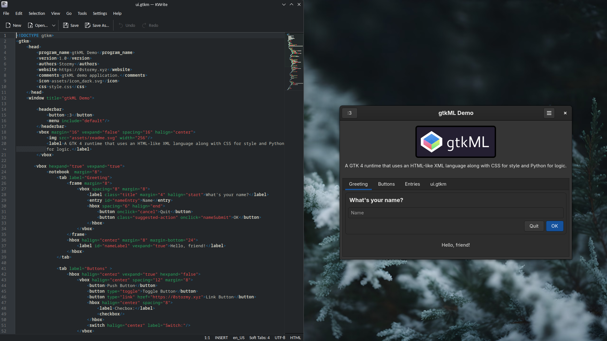

A GTK 4 runtime that uses an HTML-like XML language along with CSS for style and Python for logic.

### Example Program

### Current Widget Set:

14/59 implemented (28%)

* [x] Widget
* [x] Window
* [ ] ApplicationWindow
* [X] Box
* [ ] Grid
* [ ] Fixed
* [ ] FlowBox
* [ ] ListBox
* [ ] ListView
* [ ] ColumnView
* [ ] GridView
* [x] Frame
* [ ] AspectFrame
* [x] HeaderBar
* [x] Button
* [x] LinkButton
* [x] ToggleButton
* [x] CheckButton
* [x] Switch
* [x] Entry
* [ ] EditableLabel
* [x] Label
* [x] TextView
* [ ] DrawingArea
* [x] Image/Picture
* [ ] IconView *(deprecated in GTK4.10+)*
* [ ] ComboBox *(deprecated in GTK4.10+)*
* [ ] DropDown
* [x] MenuButton
* [x] Notebook
* [x] Tab
* [ ] Calendar
* [ ] Expander
* [ ] Statusbar *(deprecated in GTK4.10+)*
* [ ] InfoBar *(deprecated in GTK4.10+)*
* [ ] Dialog *(deprecated in GTK4.10+)*
* [ ] FileDialog (since 4.10)
* [ ] ColorDialog (since 4.10)
* [ ] FontDialog (since 4.10)
* [ ] VolumeButton *(deprecated in GTK4.10+)*
* [ ] MediaControls
* [ ] Video
* [ ] WindowControls
* [ ] ConstraintLayout
* [ ] CenterBox
* [ ] FlowBoxChild
* [ ] ListBoxRow
* [ ] ColumnViewColumn
* [ ] ColumnViewRow
* [ ] ListItem
* [ ] ListItemFactory
* [ ] FilterListModel
* [ ] CustomSorter
* [ ] DragSource
* [ ] DropTarget
* [ ] GestureDrag
* [ ] GestureClick
* [ ] GestureLongPress
* [ ] GesturePan

### How to use

1. Make sure you have `python3`, `gtk4`, and `pip` installed (You probably do if on Linux)
2. Run `build.sh`
3. Run the binary made from the script.